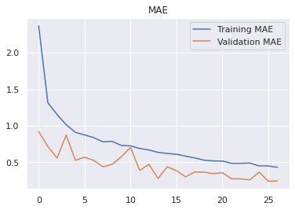

# Portfolio
Hi, my name is Carlo Abimanyu. These are my Data Science portfolios.

## [Indonesia Mobility Changes due to COVID-19 -  Data Visualization with Tableau](https://public.tableau.com/views/IndonesiamobilitychangesduetoCOVID-19/Dashboard?:language=en&:display_count=y&:origin=viz_share_link)
### November 2020
*keywords: data visualization, dashboard, tableau*  
Saya membuat *dashboard* menggunakan Tableau Public untuk memvisualisasikan perubahan mobilitas di Indonesia akibat pandemi COVID-19. Pada project ini saya belajar membuat *scatter plot*, *filter*, *map*, dan beberapa fitur-fitur lainnya dari Tableau Public.  

## [Predict Molecular Atomization Energy using XGBoost Regression Tree and Neural Network](#)
### May 2020 - present
*keywords: XGBoost, neural network, deep learning, regression*  
Dataset diperoleh dari *database* PubChem yang memuat informasi mengenai posisi dan muatan atom dalam molekul serta bentuk multipole molekul. Informasi tersebut digunakan untuk membangun fitur berdasarkan definisi Matriks Coulomb ([Rupp dkk, 2012](https://journals.aps.org/prl/abstract/10.1103/PhysRevLett.108.058301)). Kemudian dengan menggunakan fitur tersebut, saya membangun model *machine learning* untuk memprediksi energi atomisasi molekul sebagai alternatif lain jika penyelesaian persamaan Schrodinger secara analitik maupun simulasi numerik mengalami kebuntuan. 
* Model XGB memiliki MAE 16.69 kcal/mol dengan durasi training 86.7 detik dan durasi prediksi 0.18 detik.
* Model Neural Network memiliki MAE 77.14 kcal/mol dengan durasi training 195.0 detik dan durasi prediksi 0.77 detik.  

